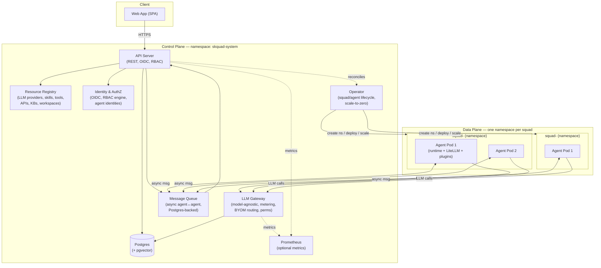

# skquad — High-Level Architecture

> **Status:** Draft v1 · **Companion to:** [`REQUIREMENTS.md`](REQUIREMENTS.md), [`domain-model.md`](domain-model.md)
>
> This is the top-level architecture. Detailed designs live in the linked
> documents. Key decisions are recorded in [`adr/`](adr/).
>
> Implementation status is tracked in
> [`implementation-status.md`](implementation-status.md); this architecture is
> partially implemented and still has documented hardening gaps.

---

## 1. Overview

skquad is a **two-plane** system on **vanilla Kubernetes**:

- **Control plane** — always-on, in a dedicated namespace (`skquad-system`).
  It is the single enforcement point for **identity, RBAC, access grants,
  metering**, and the **operator** that manages squad/agent lifecycle.
- **Data plane** — the **agent pods**, each in its own pod, grouped by **squad
  namespace**. Agents are **scale-to-zero**: they only consume resources while
  working.

The v1 deployment model is a **single organization operating its own Kubernetes
install** through the Helm chart and Skquad operator. The design optimises for
**simplicity** (a small, boring core) and **extensibility** (capabilities added
via **plugins**), while keeping **security** (OIDC, two-layer RBAC, audit) and
squad/agent isolation load-bearing.



---

## 2. Control Plane Components

| Component | Responsibility | Notes |
|-----------|----------------|-------|
| **API Server** | REST API for the web app + external clients. AuthN (OIDC), AuthZ (RBAC). CRUD for squads, agents, boards, tasks, registry, metering. | The single entry point. Enforces user RBAC + access grants. |
| **Web App** | SPA for users: create squads, manage boards, chat with agents, view metering, admin the registry. | Served by (or in front of) the API server. |
| **Resource Registry** | Catalog of LLM providers, skills, tools, APIs, knowledge bases, project workspaces. | Registered by platform admin; granted to agents by squad owner. |
| **Identity & AuthZ** | OIDC integration, RBAC engine, agent identity + credential management. | Two-layer RBAC: user (admin-managed) + agent (owner-managed). |
| **LLM Gateway** | Model-agnostic gateway all agent LLM calls flow through. Token metering, per-token pricing → cost, BYOM routing, agent permission enforcement. | Central to metering + BYOM. |
| **Message Queue** | Async agent↔agent messaging (delegate, consult, cross-squad ping). | Postgres-backed for v1; swappable interface. |
| **Operator** | K8s operator: squad/agent lifecycle, namespace isolation, scale-to-zero. | controller-runtime / kubebuilder. |
| **Postgres** | Data persistence + agent long-term memory (pgvector) + audit log + metering. | Single primary store. |
| **Prometheus** | Optional metrics (observability feature). | Enabled per deployment. |

---

## 3. Data Plane Components

| Component | Responsibility | Notes |
|-----------|----------------|-------|
| **Agent Pod** | Runs the **agent runtime** (thin custom runtime + LiteLLM + plugins). Picks up tasks, calls the LLM gateway, uses permitted resources, sends/receives async messages. | One pod per agent. Scales 0↔1. |
| **Agent Secrets** | The agent's credentials (LLM keys, resource credentials). | Per-agent, in the squad namespace. |
| **Network Policies** | Isolate the squad namespace; allow only the paths the agent needs (LLM gateway, message queue, permitted resources). | Enforce squad isolation. |

---

## 4. Key Request Flows

### 4.1 Onboarding — the "minutes" flow
```
1. User logs in (OIDC) → API Server issues session/JWT.
2. User creates a Squad → API records it → Operator creates the squad namespace.
3. User adds an Agent → API records it → owner creates the agent identity/credential
   → Operator creates a Deployment (0 replicas, scale-to-zero).
4. User picks a predefined LLM Provider → API links the agent to the provider.
5. Done — the agent can pick up tasks.
```

### 4.2 Task execution
```
1. User creates a Task on the squad board (web app) → API records it.
2. Task assigned to an Agent → API signals the Operator (or Operator watches).
3. Operator scales the agent Deployment 0 → 1.
4. Agent pod starts → resets working context → picks up the Task → executes:
   - calls the LLM via the LLM Gateway (metered),
   - uses permitted tools / skills / knowledge bases.
5. LLM Gateway counts tokens → records metering (agent + squad).
6. Agent completes the Task → updates status → scales back to 0 after idle timeout.
```

### 4.3 Cross-squad communication
```
1. Agent A (squad 1) wants to hand off a task to Agent B (squad 2).
2. Agent A calls the API (messaging endpoint) → API checks the access grant
   (may squad 1's agent talk to squad 2's agent?).
3. If permitted → API enqueues a message / creates a task on squad 2's board + pings B.
4. Operator scales Agent B 0 → 1 → B picks up the task.
5. If B is busy → the message is queued (delivered only when B is free).
```

### 4.4 Metering
```
1. All agent LLM calls flow through the LLM Gateway.
2. Gateway counts input/output tokens per call, attributes to agent + squad.
3. Records metering in Postgres.
4. If the provider has per-token pricing → computes cost.
5. Web app displays metering per agent / per squad.
```

---

## 5. Isolation Model

- **Squad boundary = K8s namespace.** Agents of different squads cannot reach
  each other's pods directly. Cross-squad interaction goes through the
  **control plane / message queue**, which enforces **access grants**.
- **Agent boundary = pod.** Each agent has its own identity, credentials, and
  permission set. An agent can only use registry resources it is **permitted**
  to use (enforced at the LLM gateway and resource connectors).
- **Control plane** is the only always-on, cross-squad component and the
  enforcement point for RBAC, access grants, and metering.

---

## 6. Technology Choices

| Layer | Choice | Rationale |
|-------|--------|-----------|
| Control-plane API server | **Go** | K8s-native, single language with the operator, strong typing. |
| Operator | **Go** (controller-runtime / kubebuilder) | Standard for K8s operators. |
| Agent runtime | **Python** | LiteLLM is Python-first; rich plugin/ML ecosystem. |
| LLM gateway | **LiteLLM proxy** (Python) | Model-agnostic, virtual keys, budgeting, metering built in. |
| Message queue | **Postgres-backed** (v1) | No new infra; swappable interface (NATS later). |
| Data store | **Postgres + pgvector** | Single store for data, memory, audit, metering. |
| Web app | **React / Next.js** (TypeScript) | Fast to build, large ecosystem. |
| Deployment | **Helm + custom operator** | Vanilla K8s, no OLM. |
| Metrics | **Prometheus** | Standard; optional observability feature. |

> The exact framework/runtime decision is recorded in
> [`adr/0001-agent-runtime.md`](adr/0001-agent-runtime.md).

---

## 7. Architectural Properties

- **Simplicity:** the core is small (API, registry, gateway, queue, operator).
  Everything else is a plugin or a registry entry.
- **Extensibility:** skills, tools, LLM providers, and resource connectors are
  plugins/registry entries — added without modifying the core.
- **Security:** OIDC + two-layer RBAC + audit + namespace/pod isolation. The
  control plane is the enforcement point.
- **Multi-tenancy:** squad = namespace; agent = pod; scale-to-zero.
- **Boring technology:** Postgres, vanilla K8s, standard operator, LiteLLM.

---

## 8. Detailed Design Index

| Concern | Document |
|---------|----------|
| Agent runtime | [`agent-runtime.md`](agent-runtime.md) |
| LLM gateway | [`llm-gateway.md`](llm-gateway.md) |
| Identity & security | [`identity-security.md`](identity-security.md) |
| Resource registry | [`resource-registry.md`](resource-registry.md) |
| Kanban & task lifecycle | [`kanban-task-lifecycle.md`](kanban-task-lifecycle.md) |
| Collaboration & messaging | [`collaboration-messaging.md`](collaboration-messaging.md) |
| Deployment & operator | [`deployment-operator.md`](deployment-operator.md) |
| Observability & metering | [`observability-metering.md`](observability-metering.md) |
| Data model | [`data-model.md`](data-model.md) |
| API design | [`api-design.md`](api-design.md) |
| Web app & UX | [`web-app-ux.md`](web-app-ux.md) |
| Plugin architecture | [`plugin-architecture.md`](plugin-architecture.md) |
| Security & threat model | [`security-threat-model.md`](security-threat-model.md) |
| Key decisions | [`adr/`](adr/) |
