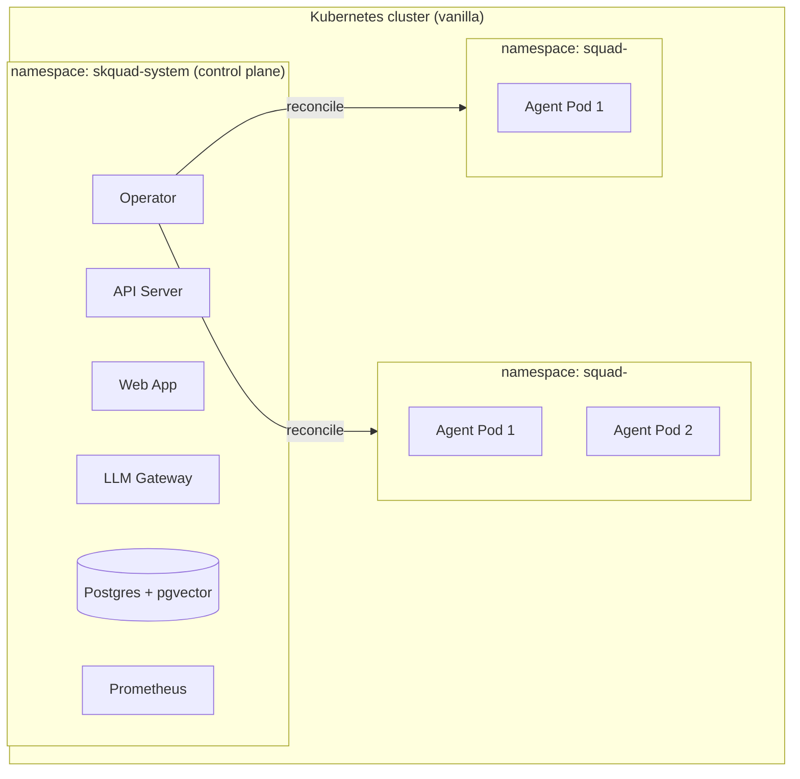

# skquad — Deployment & Operator Design

> **Status:** Draft v1 · **Decision:** [ADR-0006](adr/0006-deployment.md), [ADR-0003](adr/0003-scale-to-zero.md)
>
> skquad runs on **vanilla Kubernetes** (no OLM). A **custom operator** (Go,
> controller-runtime / kubebuilder) manages **squad** and **agent** lifecycle,
> **namespace isolation**, and **scale-to-zero**. Everything is packaged and
> deployed with **Helm**.

---

## 1. Deployment Topology



- **Control plane** — one namespace (`skquad-system`) holding the API server,
  web app, LLM gateway, operator, Postgres, and (optionally) Prometheus.
- **Data plane** — **one namespace per squad** (`squad-<id>`), each holding that
  squad's agent pods + secrets + network policies.

---

## 2. Custom Resources (CRDs)

The operator defines two CRDs:

### 2.1 `Squad`
```yaml
apiVersion: skquad.io/v1
kind: Squad
metadata:
  name: squad-<id>
  namespace: skquad-system
spec:
  squadId: <uuid>
  ownerRef: <user id>
  mission: "..."
  operatingModel: { ... }
  status: active | archived | deleted
```
- Reconciles the **squad namespace** + base resources.

### 2.2 `Agent`
```yaml
apiVersion: skquad.io/v1
kind: Agent
metadata:
  name: agent-<id>
  namespace: skquad-system
spec:
  agentId: <uuid>
  squadId: <uuid>
  role: "coder"
  defaultProviderId: "provider-or-model-alias"
  image: skquad/agent-runtime:<tag>
  credentialSecret: agent-<id>-credential
  virtualKeySecret: agent-<id>-virtual-key
  permissions: { ... }      # registry resource refs
  idleTimeout: 300s
  desiredActive: true|false  # set by control plane when work is pending
status:
  idleSince: <timestamp>     # set by operator while waiting to scale down
```
- Reconciles the agent **Deployment** and **replica count** (scale-to-zero).
  Credential Secrets are generated by the control plane and mounted by the
  operator.

> The **control plane (API server)** is the source of truth for domain state and
> **creates/updates** these CRs. The **operator** reconciles the cluster to
> match them.

---

## 3. Squad Reconciliation

When the operator sees a `Squad` CR:

1. **Create the squad namespace** (`squad-<id>`) if absent.
2. **Create base resources** in the namespace:
   - **NetworkPolicy** — isolate the namespace (default-deny; allow only the
     paths agents need: LLM gateway, message queue/Postgres, permitted
     resources).
     The starter reconciler creates default deny, DNS egress to `kube-system`,
     and platform egress back to the control-plane namespace on HTTP, gateway,
     and Postgres ports. Registry-derived egress rules come later.
   - **ResourceQuota** — cap CPU/memory per squad (configurable).
   - **ServiceAccount** — for the squad's agents.
3. **Status transitions:**
   - `active` → ensure namespace + resources exist.
   - `archived` → scale all agents to 0; keep namespace (read-only).
   - `deleted` → delete the namespace (cascades to agents, secrets, policies).
     Audit rows are retained in Postgres.

---

## 4. Agent Reconciliation

When the operator sees an `Agent` CR:

1. **Create the agent Deployment** in the squad namespace:
   - Image: the agent runtime.
   - **Replicas:** `1` if `desiredActive`; otherwise keep an existing replica
     warm until `idleTimeout` has elapsed, then scale to `0`.
   - **Secrets:** mount the agent's credential + LLM gateway virtual key when
     the Agent CR includes Kubernetes Secret names.
   - **Env:** agent config (role, default provider/model hint, permissions,
     endpoints, and `SKQUAD_TASK_LOOP_ENABLED=true`).
   - **Probes:** `/healthz`, `/readyz`.
   - **Resources:** requests/limits (configurable).
2. **React to the control plane's desired activity signal.**
3. **Scale-to-zero logic** (ADR-0003):
   - **Scale up (0 → 1):** when the control plane sets `desiredActive: true`
     (a task is assigned, or a message/ping is queued for the agent).
   - **Scale down (1 → 0):** when the agent reports **idle** (task complete,
     inbox drained) **and** the operator-observed **idle timeout** elapses with
     no new work.
4. **Error handling:** crashloop / probe failure → restart; surface to the owner;
   the task is re-queued (idempotent pickup).

---

## 5. Scale-to-Zero (detail)

```
Control plane records pending work for agent X
  → sets Agent.spec.desiredActive = true
Operator reconciles
  → Deployment replicas 0 → 1
Agent pod starts → picks up work → reports busy
  ...
Agent finishes → reports idle → inbox drained
  → control plane sets Agent.spec.desiredActive = false
  → idle timeout elapses (no new work)
Operator reconciles
  → Deployment replicas 1 → 0
```

- The **control plane** is the source of truth for "pending work" (tasks +
  messages). The **operator** only reacts to `desiredActive` + idle signals.
- **Idle timeout** is configurable (per agent or platform default). The operator
  records `status.idleSince` when an inactive Agent still has a running
  Deployment and requeues after the remaining timeout.
- **Metrics:** scale-up/down latency, time-at-zero, wake count (for cost/latency
  tuning).

---

## 6. Helm Chart Layout

```
charts/skquad/
├── Chart.yaml
├── values.yaml
├── crds/                        # Squad, Agent
│   ├── skquad.io_squads.yaml
│   └── skquad.io_agents.yaml
└── templates/
    ├── namespace.yaml              # skquad-system
    ├── api-server-deployment.yaml
    ├── api-server-rbac.yaml
    ├── api-server-service.yaml
    ├── api-server-serviceaccount.yaml
    ├── llm-gateway-configmap.yaml
    ├── llm-gateway-deployment.yaml
    ├── llm-gateway-service.yaml
    ├── operator-deployment.yaml
    ├── operator-rbac.yaml           # ClusterRole/Binding (needs cross-ns)
    ├── operator-serviceaccount.yaml
    ├── postgres-secret.yaml
    ├── postgres-service.yaml
    ├── postgres-statefulset.yaml
    ├── web-deployment.yaml
    ├── web-service.yaml
    ├── ingress.yaml                 # optional public route
    └── prometheus/                   # optional (observability feature)
        └── ...
```

- **One chart** installs the whole control plane + operator.
- **Squad/agent resources** are created via the **API** (not by hand) — the API
  creates the CRs, the operator reconciles them.
- **Values** configure images, replicas, resources, Postgres, idle timeout,
  ingress, observability toggle, etc.
- **Secrets** default to chart-managed dev values, but production installs can
  point Postgres and the API database URL at pre-created Kubernetes Secrets.

---

## 7. Control Plane Deployment

| Component | Workload | Notes |
|-----------|----------|-------|
| **API Server** | Deployment (≥2) | Stateless; talks to Postgres; creates CRs. |
| **Web App** | Deployment (≥1) | Serves the SPA; can be same as API server or separate. |
| **LLM Gateway** | Deployment (≥2) | Stateless; LiteLLM proxy; talks to Postgres + providers. |
| **Operator** | Deployment (1, leader-elected) | Needs cluster-wide RBAC (namespaces, deployments, secrets). |
| **Postgres** | StatefulSet (or managed) | + pgvector; the primary store. |
| **Prometheus** | Deployment (optional) | Scrapes metrics when observability is enabled. |

- The **operator** needs a **ClusterRole** (it creates namespaces + deployments
  across the cluster). All other components are namespace-scoped.

---

## 8. Network Policies & Isolation

- **Squad namespaces** are **default-deny**; egress allowed only to:
  - The **LLM gateway** (control plane).
  - **Postgres** (message queue + memory) — or via the control plane.
  - **Permitted resource endpoints** (KBs, workspaces) — as granted.
- The current starter policy allows DNS plus platform namespace egress; granted
  external resource endpoints will be rendered into additional policies later.
- **No direct pod-to-pod** between squads — cross-squad interaction goes through
  the **control plane / message queue** (which enforces access grants).
- The **control plane** is reachable by squad agents (for API + gateway +
  queue) but squad namespaces cannot reach each other.

---

## 9. Installation & Upgrades

- **Install:** `helm install skquad charts/skquad -n skquad-system --create-namespace`
  (CRDs installed first).
- **Configure:** set values (Postgres, OIDC, LLM providers, idle timeout,
  ingress, observability). Use existing Secrets for production database
  credentials instead of committing credentials into values.
- **Upgrade:** `helm upgrade` — the operator + control plane roll out; CRDs are
  versioned for backward compatibility.
- **Uninstall:** `helm uninstall` — removes the control plane; squad namespaces
  are removed via the operator (or manually).

---

## 10. Observability (deployment-level)

- **Prometheus** (optional, enabled via values) scrapes:
  - Control-plane metrics (API, gateway).
  - Operator metrics (reconcile rate, scale-up/down latency).
  - Agent metrics (when pods are up).
- **Logging:** structured logs to stdout (collected by the cluster's logging
  stack).
- **Alerts:** on operator errors, gateway error rate, Postgres health.

---

## 11. Open Points

- **Postgres** — StatefulSet vs. managed (RDS/Cloud SQL) vs. external; confirm
  the default for v1 (managed recommended for production).
- **Multi-cluster** — out of scope for v1 (single cluster).
- **Resource quotas** — default per-squad quotas (tune during implementation).
- **Image pull secrets** — for private agent-runtime images (later).
