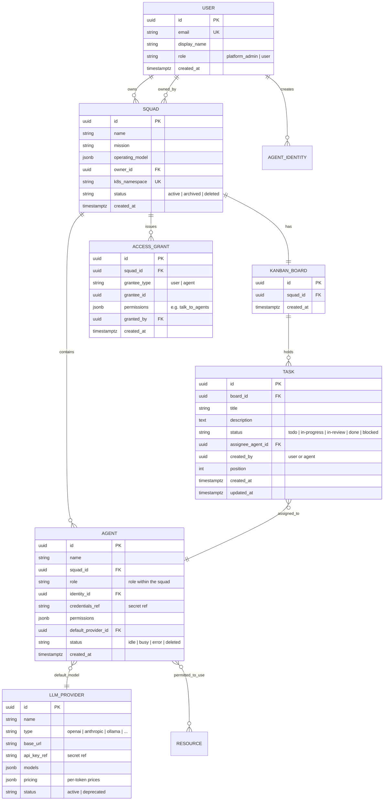

# skquad — Domain Model & Entity Lifecycle

> **Status:** Draft v1 · **Part of:** Architecture design
>
> This document defines the first-class entities, their relationships,
> ownership rules, and lifecycle. It is the shared vocabulary for the rest of
> the architecture. The physical schema lives in [`data-model.md`](data-model.md).

---

## 1. Entity Overview



> `RESOURCE` is a generic label for the registry catalog (LLM providers,
> skills, tools, APIs, knowledge bases, project workspaces). See
> [`resource-registry.md`](resource-registry.md) for the per-type shape.

---

## 2. Entities

### 2.1 User
- A **human**, authenticated via **OIDC**.
- Has a **role** in the platform: `platform_admin` or `user`.
- **Owns** zero or more squads.
- **Creates** agent identities (see D4).

### 2.2 Squad
- The **unit of multi-tenancy** and isolation.
- **Owned by exactly one User.**
- Has a **mission** (what it is for) and an **operating model** (roles +
  collaboration rules, stored as a structured document).
- **Isolated in its own Kubernetes namespace** (`k8s_namespace`).
- **Contains** one or more agents.
- **Has** exactly one Kanban board.
- **Issues** access grants (to other users or other squads' agents).

### 2.3 Agent
- A **member of a squad**.
- **Runs in its own pod** (a Deployment that scales 0↔1).
- Has its **own identity** (an `AgentIdentity` created by the squad owner) and
  **credentials** (a secret reference).
- Has a **role** within the squad (from the operating model) and a **set of
  permissions** (which registry resources it may use).
- Has a **default LLM provider** (from the registry).
- **Working context is task-scoped** — reset before each new task.
- Has **long-term memory** (Postgres + pgvector) that persists across tasks.

### 2.4 Kanban Board
- **One per squad.**
- The **primary work surface** for the squad.
- **Holds** tasks in columns (`todo`, `in-progress`, `in-review`, `done`,
  `blocked`).

### 2.5 Task
- The **unit of work** on a board.
- Has a **status** (column), an **assignee agent**, and a **creator** (a user or
  an agent — agents can create tasks, including on other squads' boards).
- When an agent picks up a task, its **working context is reset** first.

### 2.6 Operating Model
- A **structured document on the squad** describing:
  - The **role** of each agent (e.g. "planner", "coder", "reviewer").
  - **How they collaborate** (who delegates to whom, consultation rules).
- Drives agent behaviour and is surfaced in the web app.

### 2.7 Resource Registry (catalog)
A catalog of things agents can use. Each entry is registered by the **platform
admin** and granted to agents by the **squad owner**. Types:

- **LLM Provider** — a model endpoint + models + optional per-token pricing.
- **Skill** — a packaged, reusable capability (prompt + logic).
- **Tool** — a callable function.
- **API** — an external HTTP endpoint.
- **Knowledge Base** — a vector database collection.
- **Project Workspace** — git repo / Jira / Confluence.

### 2.8 Access Grant
- An **owner-issued** permission for a **grantee** (another **user** or another
  squad's **agent**) to **talk to** the squad's agents (and, for cross-squad
  agents, to add tasks / ping).
- Enforced by the control plane and the messaging layer.

---

## 3. Relationships & Ownership

| Relationship | Cardinality | Owner / Authority |
|--------------|-------------|-------------------|
| User → Squad (owns) | 1 : * | User |
| Squad → Kanban Board | 1 : 1 | Squad |
| Squad → Agent (contains) | 1 : * | Squad owner |
| Squad → Access Grant | 1 : * | Squad owner |
| Kanban Board → Task | 1 : * | Board (created by user or agent) |
| Task → Agent (assigned) | * : 1 | Assigning user / agent |
| Agent → LLM Provider (default) | * : 1 | Squad owner |
| Agent → Resource (permitted) | * : * | Squad owner (grant), platform admin (register) |
| User → Agent Identity (creates) | 1 : * | User (squad owner) |
| Squad → User (owned by) | * : 1 | — |

**Ownership rules (summary):**
- A **squad** is owned by one **user**.
- **Agents** are created and owned by the **squad owner**.
- **Registry resources** are registered by the **platform admin**.
- **Agent permissions** (which resources an agent may use) are set by the
  **squad owner**.
- **User RBAC** (platform roles) is managed by the **platform admin**.
- **Access grants** are issued by the **squad owner**.

---

## 4. Lifecycle

### 4.1 User
```
[OIDC first login] → active → (deactivated by admin)
```
- Provisioned on first OIDC login (or pre-created by an admin).
- Deactivation is reversible; owned squads are not deleted.

### 4.2 Squad
```
[owner creates] → active → archived → deleted
```
- **Create:** the control plane records the squad; the **operator** creates the
  K8s **namespace** (+ base resources: board, network policy, quotas).
- **Active:** agents run, tasks flow.
- **Archived:** read-only; agents scale to zero; no new tasks.
- **Deleted:** the operator deletes the namespace (cascades to agents, board,
  tasks, secrets). Audit log rows are retained.

### 4.3 Agent
```
[owner creates + identity] → idle(0) ⇄ busy(1) → error → deleted
```
- **Create:** the owner creates the agent **and its identity/credential**; the
  operator creates a **Deployment with 0 replicas** (scale-to-zero).
- **Idle (0 replicas):** no task, no pending message.
- **Wake → busy (1 replica):** a task is assigned **or** a message/ping is
  queued → the operator scales to 1; the agent **resets its working context**
  and starts the task.
- **Busy:** processing a task; incoming messages are **queued** (not delivered
  until the task completes — protects context).
- **Back to idle:** task done + queue drained + idle timeout elapsed → scale to
  0.
- **Error:** crashloop / health failure → surfaced to the owner; operator may
  restart.
- **Deleted:** operator deletes the Deployment + secrets.

### 4.4 Task
```
todo → in-progress → in-review → done
        ↘ blocked (↺ back to any)
```
- **Create:** by a user (on their squad's board) or by an agent (including on
  another squad's board, if permitted).
- **Assign:** to an agent (by a user or by delegation).
- **Pick up:** the agent's context resets, it moves to `in-progress`.
- **In review / done:** agent or user advances the column.
- **Blocked:** flagged; can return to any column.

### 4.5 Registry Resource
```
[admin registers] → active → deprecated
```
- Registration is a platform-admin action. Deprecation hides it from new
  grants but does not break existing running agents.

### 4.6 Access Grant
```
[owner grants] → active → revoked
```
- Granting is a squad-owner action. Revocation takes effect on the next
  authorization check.

---

## 5. Isolation & Boundaries

- **Squad boundary = K8s namespace.** Agents of different squads cannot reach
  each other's pods directly; cross-squad interaction goes through the
  **control plane / messaging layer**, which enforces **access grants**.
- **Agent boundary = pod.** Each agent has its own identity, credentials, and
  permission set. An agent can only use registry resources it is **permitted**
  to use (enforced at the LLM gateway and resource connectors).
- **Control plane** is the only always-on, cross-squad component; it is the
  enforcement point for RBAC, access grants, and metering.

---

## 6. Notes & Open Points

- **Operating model** is modelled as a structured document (JSON) on the squad
  for v1; a richer schema can be introduced later without breaking the core.
- **Agent identity** is a distinct entity (created by the owner) so that
  credentials and permissions can be managed independently of the agent's
  runtime config (see D4 and [`identity-security.md`](identity-security.md)).
- **Task creator** can be a user **or** an agent (needed for cross-squad task
  handoff). The `created_by` is polymorphic (user id or agent id).
