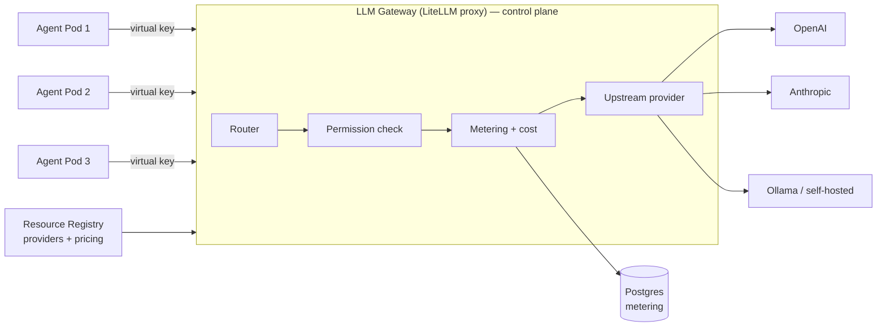

# skquad — Central LLM Gateway Design

> **Status:** Draft v1 · **Decision:** [ADR-0002](adr/0002-llm-gateway.md)
>
> The LLM gateway is the **single, model-agnostic endpoint** that **all agent
> LLM calls** flow through. It is the enforcement point for **metering, cost,
> BYOM routing, and agent permissions**. It is implemented with the **LiteLLM
> proxy**.

---

## 1. Why a Central Gateway

If every agent called LLM providers directly, we would:

- Duplicate **metering** logic in every agent.
- Scatter **credential** handling across agents.
- Make agent code **model-specific** (breaking BYOM).

A central gateway solves all three in one place: agents call **one endpoint**
with **one virtual key**, and the gateway handles routing, metering, cost, and
permissions.

---

## 2. Responsibilities

| Responsibility | Detail |
|----------------|--------|
| **Model-agnostic routing** | Agents request a *model*; the gateway routes to the correct upstream provider (OpenAI, Anthropic, Ollama, …). |
| **BYOM** | Routes to the right provider with the right credentials (from the registry / secrets). Users can bring their own provider + key. |
| **Metering** | Counts **input + output tokens** per call and attributes them to the **agent** and **squad**. |
| **Cost** | Computes **monetary cost** when the provider has **per-token pricing** configured. |
| **Permission enforcement** | An agent can only use **providers/models it is permitted** to use (checked against the agent's permission set). |
| **Virtual keys** | Issues a **virtual key per agent** so calls are attributable, rate-limitable, and budgetable. |
| **Rate limiting / budgets** | Per-agent (and per-squad) rate limits and optional spend budgets. |

---

## 3. Architecture



- The gateway runs as a **highly-available Deployment** in the control plane
  (`skquad-system`).
- It is **stateless** — all state (metering, keys, budgets) lives in Postgres.
- It reads **provider definitions** (base URL, models, pricing) from the
  **resource registry** and **credentials** from secrets.

---

## 4. Virtual Keys

- Each **agent** is issued a **virtual key** by the gateway (via the control
  plane) when the agent is created.
- The agent uses **only its virtual key** to call the gateway — it never holds
  upstream provider credentials.
- The virtual key encodes the **agent identity** (and squad), so every call is
  attributable for metering, permissions, and rate limiting.
- Keys can be **rotated** and **revoked** (e.g. when an agent is deleted or its
  permissions change).

---

## 5. Metering & Cost

- For every completed call, the gateway records:
  - **agent id**, **squad id**, **model**, **provider**
  - **input tokens**, **output tokens**
  - **timestamp**
  - **cost** (if the provider has per-token pricing)
- **Cost calculation:** `cost = input_tokens × price_per_input_token +
  output_tokens × price_per_output_token` (prices from the provider's registry
  entry).
- Records are written to the **metering table** in Postgres (see
  [data-model.md](data-model.md)).
- The **web app** aggregates metering per agent and per squad (and shows cost
  where pricing is configured).

```
POST /v1/chat/completions  (agent → gateway)
  → route to provider
  → on response: record {agent, squad, model, in_tokens, out_tokens, cost, ts}
  → return response to agent
```

---

## 6. BYOM Routing

- The **resource registry** holds **LLM provider** entries: `type`, `base_url`,
  `api_key_ref` (secret), `models`, `pricing`.
- The gateway maps a requested **model** to its **provider** and routes the
  call to the provider's `base_url` using the provider's credentials.
- **Predefined providers** (admin-registered) power the fast onboarding path.
- **BYOM providers** (user-registered, with the user's key) are routed the same
  way — the agent just requests a model.

---

## 7. Permission Enforcement

- Before routing a call, the gateway checks the **agent's permission set**
  (from the control plane): is this agent permitted to use this **provider /
  model**?
- If not → **reject** the call (403) and log the attempt (audit).
- This means an agent can only spend on / use models its **squad owner** allowed.

---

## 8. API Surface (agent-facing)

The gateway exposes an **OpenAI-compatible** API (so LiteLLM and agent code stay
simple):

- `POST /v1/chat/completions`
- `POST /v1/completions`
- `GET /v1/models` (models the calling agent is permitted to use)

Control-plane management endpoints (for the API server, not agents):

- `POST /key/generate` (issue a virtual key for an agent)
- `POST /key/info`, `POST /key/update`, `POST /key/delete`
- `GET /global/spend`, `GET /spend` (metering queries)

---

## 9. High Availability & Operations

- Run as a **Deployment** with ≥2 replicas; it is stateless.
- **Health checks** (`/health/liveliness`, `/health/readiness`).
- **Metrics** (Prometheus): requests, tokens, cost, latency, errors, per
  provider/model.
- **Alerts** on error rate, latency, and spend anomalies.
- **Backpressure / rate limiting** per virtual key to protect upstream providers.

---

## 10. Relationship to Other Components

- **Agent runtime** → calls the gateway (the only LLM path).
- **Resource registry** → provides provider definitions + pricing.
- **Identity & AuthZ** → provides the agent's permission set (for enforcement).
- **Postgres** → stores metering, keys, budgets.
- **Web app** → reads metering/cost for display.

---

## 11. Open Points

- **Caching** — semantic/exact caching of repeated calls to cut cost (later).
- **Fallbacks** — automatic failover to a secondary model on provider errors
  (later).
- **Budgets** — hard spend caps per agent/squad with automatic cutoff (later).
- **Streaming** — support streaming responses end-to-end (confirm in
  implementation).
